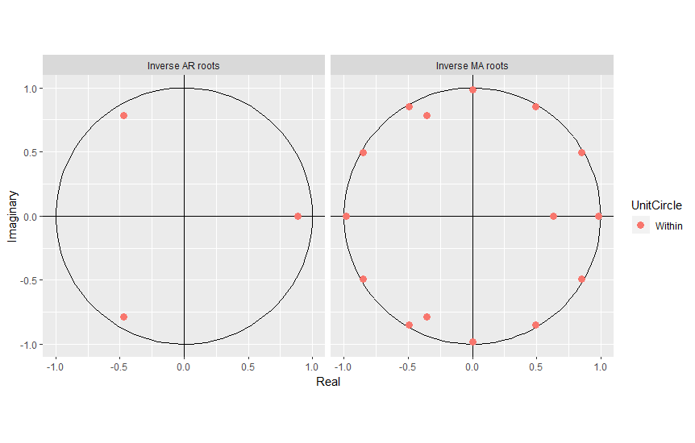

# Forecast-FX-for-FP-A-using-R

A step by step project on how to forecast FX rates in a FP

A environment using R

## Getting Started

These instructions will get you a copy of the project up and running on your local machine for development and testing purposes. See deployment for notes on how to deploy the project on a live system.

### Prerequisites

What things you need to install the software and how to install them

```
Give examples
```

### Installing

A step by step series of examples that tell you how to get a development env running

Say what the step will be

```
Give the example
```

## Running the tests

```r
view(a10)
str(a10)
>Time-Series [1:204] from 1992 to 2008: 3.53 3.18 3.25 3.61 3.57 ...
```



